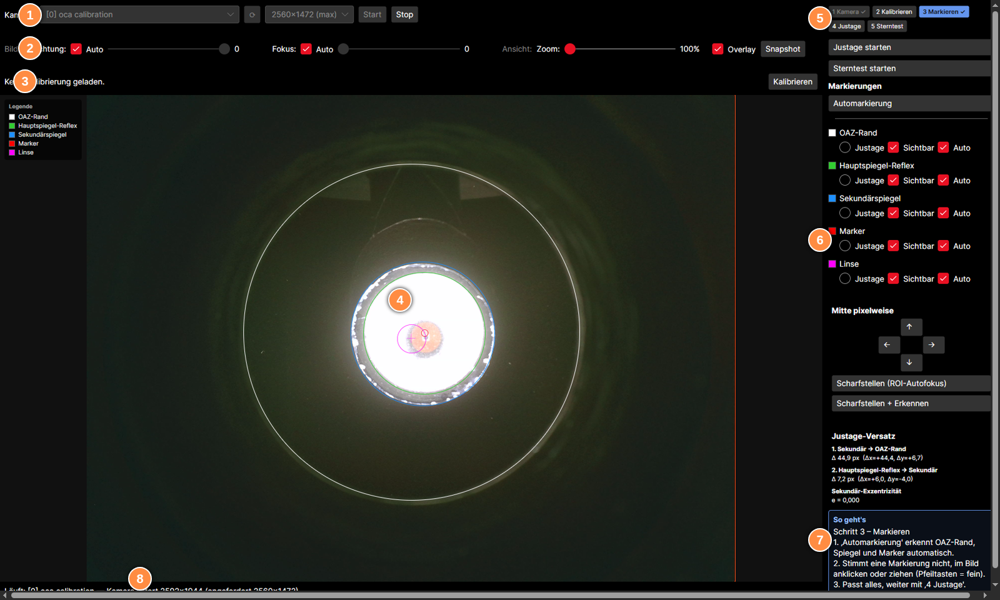
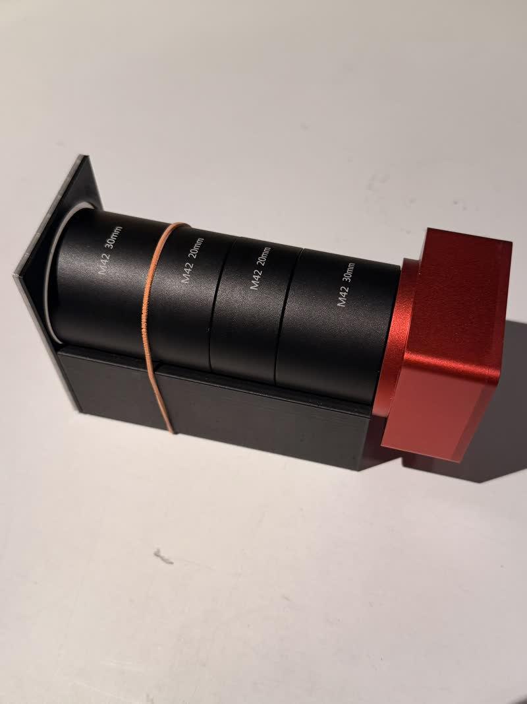
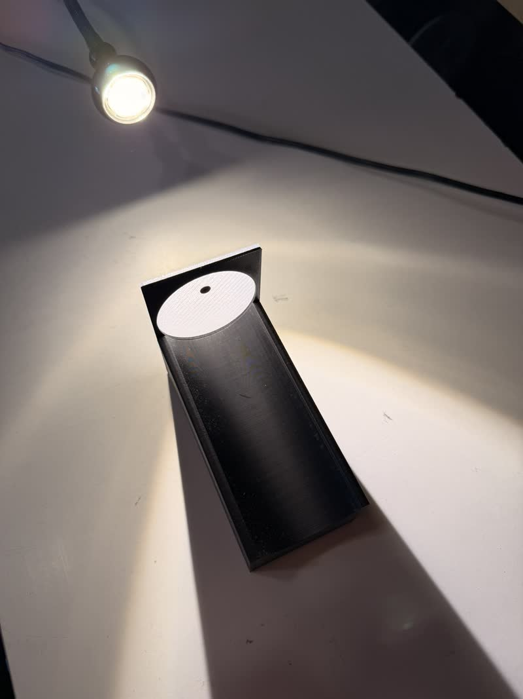
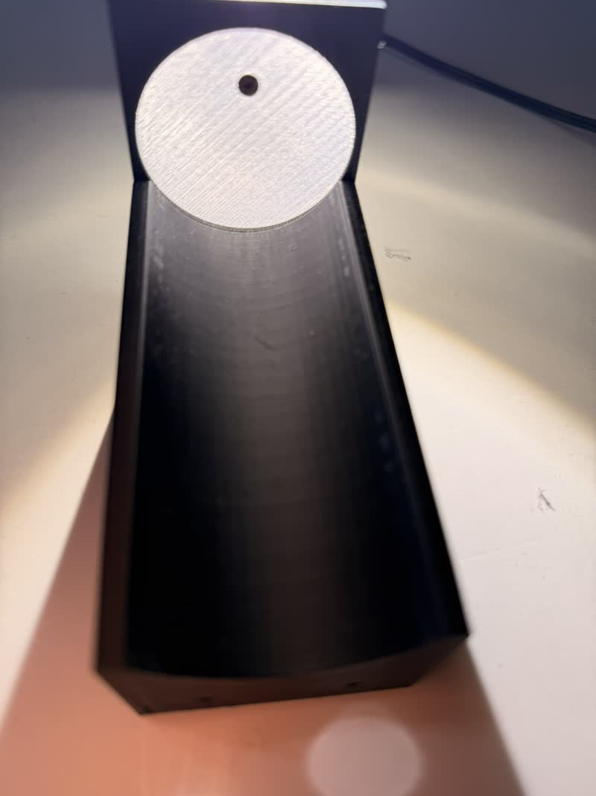
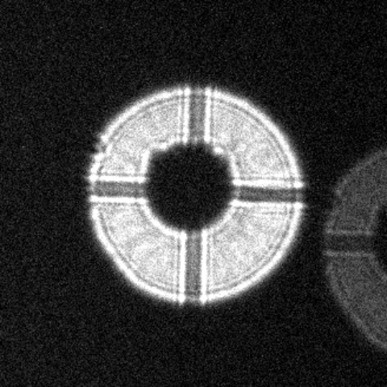
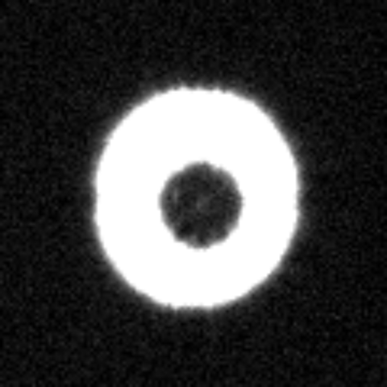
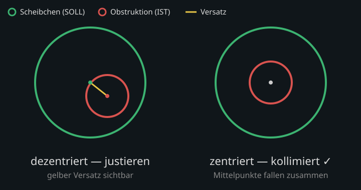
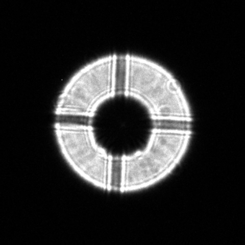
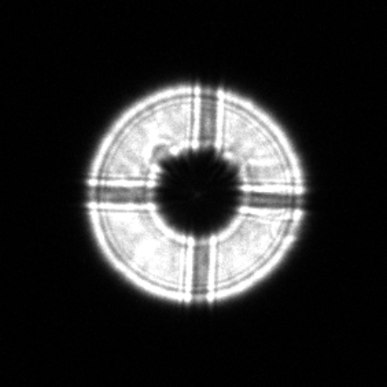

# FreeCol — Anleitung für Einsteiger

Diese Anleitung richtet sich an dich, wenn du zum ersten Mal einen Newton-Teleskop
mit FreeCol justierst. Sie beschreibt jeden Schritt der App in der Reihenfolge,
in der du ihn tatsächlich brauchst.

---

## 1. Überblick

FreeCol führt dich in zwei Etappen zu einem kollimierten (optisch korrekt
ausgerichteten) Newton-Teleskop:

1. **Grobjustage mit der Justagekamera** — du steckst eine Justagekamera (z. B.
   eine OCAL) anstelle des Okulars in den Okularauszug (OAZ). Die App spricht
   sie als generisches UVC-Gerät an. Sie zeigt live, wie Fangspiegel und
   Hauptspiegel relativ zueinander und zum OAZ stehen, und führt dich in
   geführten Phasen durch die nötigen Schraubendrehungen.
2. **Feinjustage am echten Stern** — mit einer Astrokamera nimmst du ein
   absichtlich unscharfes („defokussiertes“) Bild eines hellen Sterns auf. Das
   Bild zeigt einen Ring mit dunklem Kern (den „Donut“). FreeCol misst dessen
   Versatz und übersetzt ihn wieder in Schraubendrehungen an den
   Hauptspiegel-Justierschrauben.

Beide Etappen laufen in derselben App, im selben Fenster. Rechts in der
Seitenleiste siehst du eine **Workflow-Leiste** mit fünf Schritten:

| # | Schritt | Bedeutung |
|---|---------|-----------|
| 1 | Kamera | Kamera wählen und starten |
| 2 | Kalibrieren | optional: Kreis-Kalibrierung der Justagekamera |
| 3 | Markieren | Markierungen setzen (automatisch oder manuell) |
| 4 | Justage | geführte Justage in Phasen 0–3 |
| 5 | Sterntest | Feinjustage am echten Stern |

Ein grüner Chip markiert einen erledigten Schritt, ein blau hervorgehobener
Chip den Schritt, in dem du dich gerade befindest. Die Schritte 3–5 sind
klickbar und wechseln direkt den Modus; Chip 2 (Kalibrieren) startet per
Klick den Kalibrier-Wizard (bei laufender Kamera) und ist während der
Kalibrierung der aktive Schritt. Chip 1 (Kamera) ist eine reine
Status-Anzeige.

Alle drei umschaltbaren Modi (Markieren, Justage, Sterntest) zeigen unten in
der Seitenleiste außerdem eine blaue **„So geht's“-Box** mit einer kurzen,
modusspezifischen Anleitung — Details dazu in den jeweiligen Kapiteln.

So ist das Fenster aufgebaut (hier: laufende Justagekamera im
Markierungs-Modus):

1. **Kamera-Zeile** — Gerät wählen, Auflösung, Start/Stop (Kapitel 3)
2. **„Bild & Ansicht“-Zeile** — Belichtung, Fokus, Zoom, Overlay, Snapshot;
   erscheint nur bei laufender Kamera
3. **Kalibrier-Statusleiste** — Stand der Kreis-Kalibrierung, „Kalibrieren“/„Löschen“ (Kapitel 4)
4. **Live-Bild** mit den farbigen Markierungs-Ringen (Legende oben links)
5. **Workflow-Leiste** — die fünf Schritte mit Erledigt-Häkchen
6. **Seitenleiste** — Panel des aktiven Modus, darüber Hinweis- und
   Entscheidungs-Banner
7. **„So geht's“-Box** — Kurzanleitung zum aktiven Modus bzw. zur aktiven Phase
8. **Statuszeile** — letzte Meldung der App

(Das Bild lässt sich mit `docs/anleitung/make-uebersicht.sh` reproduzierbar
neu erzeugen.)

---

## 2. Voraussetzungen

- **Für die Grobjustage**: eine Justagekamera (z. B. OCAL oder ein anderes
  UVC-fähiges Kamera-Modul), die anstelle des Okulars in den Okularauszug
  passt. FreeCol spricht sie als generisches UVC-Gerät an — es gibt keine
  Hersteller-SDK-Bindung dafür.
- **Für den Sterntest**: eine Astrokamera. FreeCol unterstützt hierfür wahlweise
  eine Alpaca-/INDIGO-Verbindung übers Netzwerk, eine native ZWO-ASI-Kamera
  per USB, eine Bilddatei (FITS/PNG/JPG/TIFF) oder einen überwachten Ordner,
  in den eine andere Aufnahmesoftware speichert.
- Ein Teleskop, an dem sich Fangspiegel-Zentrierung (falls vorhanden),
  Fangspiegel-Kippung und Hauptspiegel-Kippung über Schrauben einstellen
  lassen.
- Optional: 3D-gedruckte Hilfen fürs Kalibrieren (Kapitel 4, Abschnitt
  „3D-gedruckte Kalibrier-Hilfen“).

---

## 3. Schritt 1 — Kamera verbinden

Oben im Fenster wählst du die Kamera aus der Dropdown-Liste, stellst bei
Bedarf die Aufnahme-Auflösung ein und klickst **Start**. Die Auflösung lässt
sich nur vor dem Start ändern; eine höhere Auflösung liefert mehr Pixel für
kleine Strukturen wie den Marker-Ring, macht aber Kalibrierung und
Markierungen danach nötig, weil sie neu vermessen werden müssen.

Beim nächsten Programmstart verbindet sich FreeCol automatisch wieder mit der
zuletzt verwendeten Kamera.

Markierungen und Kalibrierung sind an die Auflösung gebunden, mit der sie
erstellt wurden. Startest du dieselbe Kamera später mit einer anderen
Auflösung, zeichnet FreeCol keine falsch skalierten Ringe, sondern zeigt eine
orange Warnung mit beiden Auflösungen — du wählst dann entweder die frühere
Auflösung zurück oder markierst neu.

**Kamera-Gate**: Solange keine Kamera läuft (und du nicht im Sterntest bist,
der arbeitet unabhängig davon dateibasiert), zeigt die Seitenleiste einen
orangen Hinweis:

> ⚠ Keine Kamera aktiv
> Markierungen und Schrauben-Daten werden erst gespeichert, wenn eine Kamera
> läuft. Oben Kamera wählen, dann: **Kamera starten**
> Nach dem Start geht's mit ‚3 Markieren' weiter — die Markierungen erkennt
> die App automatisch.

Das ist wichtig, weil Markierungen und Schrauben-Kalibrierungen pro Kamera
gespeichert werden — ohne laufende Kamera gibt es keinen Speicherort, und
deine Eingaben würden sonst kommentarlos verpuffen.

Mit den Belichtungs- und Fokus-Reglern direkt darunter stellst du ein
scharfes, gut belichtetes Bild ein (Auto-Modus oder manuell per Slider); beide
Werte merkt sich die App pro Kamera.

---

## 4. Schritt 2 — Kalibrieren (optional)

Die Kalibrierung bestimmt das optische Zentrum der Justagekamera selbst
(nicht des Teleskops) über einen Kreisfit. Sie ist **optional** — die geführte
Justage in Schritt 4 kommt ohne sie aus. Sinnvoll ist sie, wenn du zusätzlich
die klassische Versatz-Anzeige „Marker → Optisches Zentrum“ nutzen willst.

### Ablauf des Kalibrier-Wizards

Der Wizard läuft in drei Phasen, jede mit eigener Panel- und Rahmenfarbe:

1. **Orientierung** (Panel dunkles Indigo, Rahmen gelb) — richte die Kamera in
   einer Drehvorrichtung so aus, dass der Marker mittig auf der 12-Uhr-Linie
   über dem OAZ-Rand-Zentrum liegt, und halte die Position 2 Sekunden. Die App
   zeigt den aktuellen Offset in Pixeln, bis die Ausrichtung stimmt.
2. **Rotation** (Panel dunkelgrün, Rahmen hellgrün) — drehe die Kamera langsam
   und gleichmäßig um 360°. Die App sammelt automatisch Stützpunkte (sobald
   sich der Marker um mehr als ca. 6 px bewegt hat) und beendet die Phase
   selbstständig, sobald sie wieder nahe am Startpunkt ankommt.
3. **Review** (Panel dunkelblau, Rahmen hellblau) — die App zeigt das
   Kreisfit-Ergebnis (Zentrum, Radius, RMS-Residuum) und schließt mit der
   Rückfrage „Passt der grüne Kreis? Dann ‚Speichern' — sonst ‚Abbrechen' und
   neu starten.“. Mit **Speichern** schreibst du die Kalibrierung auf die
   Platte, mit **Abbrechen** verwirfst du sie.

Das RMS-Residuum ist die mittlere Abweichung der Stützpunkte vom Kreisfit:
unter 0,5 px gilt als ausgezeichnet, unter 1 px als gut, über 2 px solltest du
eher neu kalibrieren.

### Entscheidungs-Banner

Startest du eine Kamera, für die bereits eine Kalibrierung gespeichert ist,
lädt FreeCol sie automatisch — macht die Entscheidung darüber aber sichtbar,
statt sie stillschweigend zu treffen:

> Kalibrierung gefunden
> [Zeitstempel · RMS · Stützpunktanzahl]
> Für die geführte Justage nicht nötig — im Zweifel ‚Verwenden'.
> **Verwenden** | **Neu kalibrieren**

### Überschreibschutz

Klickst du direkt auf **Kalibrieren** (ohne über den Entscheidungs-Banner zu
gehen) und existiert bereits eine Kalibrierung, schaltet der erste Klick den
Button nur scharf („Wirklich neu kalibrieren?“) — erst der zweite Klick
startet den Wizard wirklich und überschreibt die alte Kalibrierung.

### 3D-gedruckte Kalibrier-Hilfen

Für den Kreisfit muss die Kamera während der Rotation-Phase gleichmäßig und
ohne Verkippen um die OAZ-Achse gedreht werden — jede Unregelmäßigkeit in der
Drehung verschlechtert das Kreisfit-Ergebnis (höheres RMS-Residuum). Die
3D-gedruckten Auflagen und Kappen führen die Kamera dabei mechanisch, damit
die Drehung sauber und ohne Kippeln gelingt.

| Datei | Zweck |
|-------|-------|
| `Rotatorauflage.stl` | Auflage, in der die Kamera für die Rotation-Phase gedreht wird — ausgelegt darauf, dass die Kamera mit 100-mm-T2-Verlängerungshülsen gut aufliegt |
| `KollimatorKappe.stl` | Kappe für den Kollimator |
| `KollimatorDruckprojekt.3mf` | Druck-Projekt mit den Einzelteilen UND dem kombinierten Teil; enthält einen Farbwechsel nach 1,5 mm, damit die Rückwand der Kappe mit durchscheinendem Material gedruckt werden kann |
| `KollimatorAuflageMitKappe.stl` | kombinierte Auflage mit Kappe |

**Aufbau**: Hinter der Kappe muss eine Lichtquelle so platziert werden, dass
der Kalibrierungspunkt gut erkennbar ist — die durchscheinende Rückwand
(Farbwechsel im 3MF-Projekt) verteilt das Licht dafür gleichmäßig. Ein
Gummiband um Hülsen und Auflage (im Foto sichtbar) sichert das leichte
Ende: Der Kamerakörper ist deutlich schwerer als die Hülsen, ohne Band kann
das vordere Ende beim Drehen versehentlich abheben — das würde einzelne
Stützpunkte verfälschen.

|  |  |  |
|---|---|---|
| Kompletter Aufbau: Justagekamera (hier: OCAL) mit 100 mm T2-Verlängerung (30+20+20+30 mm) in der Auflage, vorn die Kappe; das Gummiband hält das leichte Ende beim Drehen unten | Lichtquelle über der Kappe beleuchtet die durchscheinende Rückwand | Blick aus Kamera-Richtung: durchleuchtete Rückwand mit dem Kalibrierungspunkt |

Die Dateien liegen dem Release als „3D-Druckteile“-ZIP bei bzw. im
Repo-Ordner `3D/`.

---

## 5. Schritt 3 — Markieren

Im Markierungs-Modus setzt du fünf Markierungen auf dem Live-Bild. Jede hat
eine feste Bedeutung:

| Markierung | Farbe | Bedeutung |
|------------|-------|-----------|
| OAZ-Rand | weiß | Rand des Okularauszugs — Referenzkreis für die Zentrierung |
| Sekundärspiegel | Dodger-Blau | der kleine, schräge Fangspiegel vorn im Tubus |
| Hauptspiegel-Reflex | Hellgrün | Spiegelung des Hauptspiegels; zeigt, ob der Fangspiegel korrekt gekippt ist |
| Marker | Rot | Zentrumsmarke auf dem Hauptspiegel (Ring mit Punkt) — das Ziel für Phase 3 |
| Linse | Magenta | die dunkle Eigenlinse der Justagekamera im Marker-Ring (bei der OCAL im Marker-Ring sichtbar) — wandert beim Hauptspiegel-Kippen |

**So geht's-Box**: Im Markierungs-Modus zeigt die blaue Box unten in der
Seitenleiste die Kurzanleitung:

> Schritt 3 – Markieren
> 1. ‚Automarkierung' erkennt OAZ-Rand, Spiegel und Marker automatisch.
> 2. Stimmt eine Markierung nicht, im Bild anklicken oder ziehen
>    (Pfeiltasten = fein).
> 3. Passt alles, weiter mit ‚4 Justage'.

**Automarkierung**: Der Button **Automarkierung** erkennt alle fünf
Markierungen automatisch in zwei Durchläufen — zuerst bei aktueller Fokus-
Einstellung, danach (falls Autofokus verfügbar ist) pro Markierung
scharfgestellt und nachgezogen, weil OAZ-Rand und Marker bei hoher Auflösung
auf unterschiedlichen Fokusebenen liegen können. Am Ende meldet die
Statuszeile das Ergebnis mit konkreter Trefferzahl:

> Automarkierung fertig — alle 5 erkannt. Weiter mit ‚4 Justage'.

Wurden nicht alle fünf erkannt, benennt die Meldung stattdessen, wie viele
es waren, und verweist auf die manuelle Nacharbeit:

> Automarkierung fertig — {k}/5 erkannt. Fehlende manuell setzen, dann
> ‚4 Justage'.

**Manuelle Korrektur**: Wähle über das Radio-Feld „Justage“ eine Markierung
zur Bearbeitung aus, dann:

- **Klick** im Bild platziert sie an dieser Stelle.
- **Ziehen** verschiebt eine bereits platzierte Markierung.
- Die Pfeiltasten **⇧/⇩/⇦/⇨** im „Mitte pixelweise“-Feld verschieben sie um
  ein Pixel.
- **Entf** löscht die ausgewählte Markierung, **Strg+Z** macht das rückgängig.
- **Scharfstellen (ROI-Autofokus)** fokussiert gezielt auf die ausgewählte
  Markierung; **Scharfstellen + Erkennen** fokussiert und erkennt danach nur
  dieses eine Feature neu.

Ein Gesten-Hinweis am unteren Bildrand zeigt kontextabhängig, welche
Maus-Interaktion gerade gilt.

---

## 6. Schritt 4 — Geführte Justage

Der Justage-Modus führt dich durch vier Phasen (0–3). Die Checkbox
**„Fangspiegel-Spinne justierbar“** blendet Phase 1 aus, wenn deine Spinne
fest zentriert (z. B. CNC-gefertigt) ist — die Kipp-Phasen rücken dann in der
Nummerierung nach vorn.

**Position der Justagekamera im OAZ**: Der Imagetrain soll möglichst im
Originalzustand vermessen werden. Setze die Justagekamera deshalb so ein, dass
ihre Linse ungefähr den gleichen Abstand hat wie später der Sensor der
Astrokamera: den OAZ in die übliche Fokusposition fahren und die Restdistanz
mit Verlängerungshülsen überbrücken — nicht den OAZ weiter herausdrehen. So
justierst du für genau die Geometrie, mit der du hinterher aufnimmst.

Wie im Markierungs- und Sterntest-Modus zeigt die blaue **„So geht's“-Box**
unten in der Seitenleiste eine Kurzanleitung — hier jedoch pro Phase eine
eigene, nummerierte Schritt-für-Schritt-Anleitung (Text siehe jeweilige
Phase unten). Ein sanftes Reihenfolge-Gate warnt zusätzlich (ohne zu
blockieren), wenn eine Vorgänger-Phase noch nicht im Ziel ist:

> ⚠ [Vorgänger-Phase] ist noch nicht im Ziel — am besten zuerst dort
> weitermachen.

### Phase 0 — Orientierung (OAZ-Position)

**Ziel**: Der App mitteilen, wo der Okularauszug aus deiner Blickrichtung am
Teleskop sitzt — alle folgenden Phasen-Skizzen richten sich danach aus.

**Vorgehen**: Mit dem Winkel-Regler (0–360°) die Position einstellen; der
Indikator zeigt das rotierende OAZ-Rohr auf einem Tubus-Querschnitt. Kein
Messwert, keine Toleranz — einfach **Phase abgeschlossen** klicken, wenn die
Ausrichtung passt.

### Phase 1 — Fangspiegel zentrieren

**Ziel**: Der Fangspiegel steht mittig unter dem Okularauszug (Versatz
Sekundärspiegel → OAZ-Rand). Du arbeitest dabei **von vorn**: Blick in die
Tubusöffnung, die Spinnen-Rändelschrauben sitzen an der Fangspiegel-Halterung.

**Vorgehen**:
1. Den Spinnen-Versatz-Regler (0–90°) so einstellen, dass das angezeigte
   Spinnenkreuz der realen Lage deiner 4-Speichen-Spinne entspricht.
2. Jede der vier Rändelschrauben kalibrieren (Button **Kalibrieren** je
   Schraube): eine kleine Menge drehen (¼ Umdrehung als Startwert), die
   tatsächlich gedrehte Menge und Drehrichtung eintragen, **Bestätigen**. Erst
   nach vollständiger Kalibrierung aller Schrauben zeigt die App
   Drehempfehlungen — vorher blockiert ein orangener Hinweis:
   > ⚠ Kalibrierung nötig — Erst kalibrieren – ohne Kalibrierung keine
   > Drehempfehlung.
3. Den orangenen Pfeilen folgen (Richtung = Drehsinn, Bogenlänge ∝ nötige
   Umdrehung), bis der Fangspiegel mittig unter dem OAZ steht.

**Toleranz**: 10 px.

### Phase 2 — Fangspiegel kippen

**Ziel**: Der Hauptspiegel-Reflex sitzt zentriert unter dem Sekundärspiegel
(Versatz Hauptspiegel-Reflex → Sekundärspiegel).

**Vorgehen**:
1. Alle 3 Justierschrauben kalibrieren (gleiches Verfahren wie Phase 1).
2. Die Schrauben sind anfangs meist festgezogen: zuerst **eine** Schraube
   gegen den Uhrzeigersinn lösen, bevor du andere anziehst — sonst hat keine
   Schraube Spiel.
3. Den orangenen Pfeilen folgen. **Markierung aktualisieren** misst auf dem
   aktuellen Bild neu (siehe Hinweis zu veralteten Anzeigen unten).

**Toleranz**: 5 px.

### Phase 3 — Hauptspiegel kippen

**Ziel**: Die Linse (IST) sitzt im Marker-Punkt (SOLL). Jetzt wechselst du
die Seite und arbeitest **von hinten**: Blick auf den Tubusboden mit der
Spiegelzelle — dort sitzen die drei Justier- und die Konterschrauben des
Hauptspiegels.

**Vorgehen**:
1. **Strg+Klick** auf den Marker-Ring setzt einmalig das Ziel (SOLL) neu,
   weil sich die Ansicht durch das Fangspiegel-Kippen verschoben hat. Der
   Punkt bleibt danach fix.
2. **Klick** auf die Linsenmitte setzt das IST-Kreuz — nach jeder
   Schraubendrehung neu, da Marker-Ring und Linse nahe der Ausrichtung fast
   konzentrisch und daher nicht zuverlässig automatisch trennbar sind. Diese
   Phase erkennt deshalb **nicht** automatisch; „Markierung aktualisieren“
   verbucht hier nur die ausgeführte Drehung und prüft auf Herausdrehen.
3. Konterschrauben lösen, alle 3 Justierschrauben kalibrieren (auch hier:
   erst eine Schraube lösen). Da diese Phase nicht automatisch erkennt,
   misst „Bestätigen“ hier die Linse an der Stelle, an der du sie zuletzt
   angeklickt hast: Schraube drehen → Linse an ihrer neuen Position neu
   anklicken → „Bestätigen“.
4. Den Pfeilen folgen, bis die Linse im Marker-Punkt sitzt, danach wieder
   kontern.

**Toleranz**: 2 px.

### Gemeinsame Elemente aller Spiegel-Phasen

- **Fehlende Markierungen namentlich benannt**: Sind für die aktive Phase
  nicht alle nötigen Markierungen gesetzt, nennt der Statustext sie
  konkret statt nur allgemein zu warnen:
  > Markierungen unvollständig — es fehlt: {Namen der fehlenden
  > Markierungen}.
  In Phase 3 ergänzt die Meldung zusätzlich die Setz-Geste, weil diese Phase
  anders bedient wird als die übrigen:
  > Markierungen unvollständig — es fehlt: {Namen}. (Klick = Linse,
  > Strg+Klick = Marker)
- **„Phase abgeschlossen“ — Schnellverfahren**: Liegt der Versatz unter der
  Toleranz, schließt ein Klick die Phase sofort ab. Liegt er darüber, schaltet
  der erste Klick nur scharf („Nicht im Ziel — erneut klicken schließt
  trotzdem ab“), erst der zweite Klick erzwingt den Abschluss trotzdem.
- **Veraltete-Anzeige-Hinweis**: Zeigen die Markierungen noch den Stand aus
  dem letzten Programmstart oder Kamerawechsel statt einer frischen Messung,
  erscheint:
  > ⚠ Anzeige basiert auf gespeicherten Markierungen — „Markierung
  > aktualisieren“ misst auf dem aktuellen Bild neu.
- **Herausdreh-Warnung**: Wird eine Schraube wiederholt in dieselbe
  Lösen-Richtung empfohlen (kumulativ ≥ 3 Umdrehungen), warnt ein roter
  Hinweis, dass sie den Kontakt verlieren könnte — stattdessen eine andere
  Schraube lösen.

### Abschluss der Grobjustage

Nach Phase 3 (bzw. dem erzwungenen Abschluss) zeigt die Seitenleiste einen
grünen Banner:

> ✅ Grobjustage abgeschlossen
> 1. Konter-/Arretierschrauben vorsichtig gleichmäßig anziehen (nicht
>    überdrehen).
> 2. Mit „Markierung aktualisieren“ gegenprüfen, dass alles im Ziel bleibt.
> 3. Dann Feinjustage am echten Stern.
> **Weiter zum Sterntest**

Der Banner verschwindet, sobald du den Justage-Modus erneut betrittst (du
justierst dann bewusst neu) oder im Sterntest selbst bist.

---

## 7. Schritt 5 — Sterntest

Der Sterntest analysiert ein defokussiertes Sternbild (den „Donut“) und
übersetzt dessen Versatz in Drehempfehlungen für die drei
Hauptspiegel-Justierschrauben — unabhängig von Kamera und Markierungen aus
den vorherigen Schritten.

### Teleskop-Typ und Paar-Messung (Newton vs. RC/SC)

FreeCol unterscheidet zwei Teleskop-Typen, weil deren Kollimations-Charakteristiken
verschieden sind:

| Teleskop-Typ | Fangspiegel-Position | Einzelbild-Versatz | Verwendung |
|---|---|---|---|
| **Newton** (Voreinstellung) | absichtlich versetzt | **nicht** aussagekräftig — auch bei guter Kollimation | Muss Paar-Messung nutzen |
| **RC/SC** | konzentrisch | direkt aussagekräftig | kann mit Einzelbild arbeiten |

**Einstellung**: Oben im Panel wählst du `Newton (Fangspiegel-Offset)` oder `RC/SC (konzentrisch)`. Die Voreinstellung ist Newton, weil diese Bauart im Amateur-Bereich häufiger ist. Die Wahl wird gespeichert.

**Auswirkung**: 
- **Newton**: Drehempfehlungen erscheinen nur, wenn ein gültiges intra-/extrafokales **Paar** vorliegt. Ursache: Der Rest-Versatz im Einzelbild ist teils systematisch (echte Teleskop-Kennzahl), teils echter Kollimationsfehler — die Trennung gelingt nur im Vergleich.
- **RC/SC**: Drehempfehlungen basieren auf dem Einzelbild, wie in traditionellen Sterntest-Methoden.

### Fokus-Paar: Mitte merken und reproduzierbar fahren

Mit einem verbundenen Fokuser (Alpaca) kannst du eine reproduzierbare Fokus-Mitte
setzen und eine feste Defokus-Strecke beidseits anfahren — ideal für die Paar-Messung:

1. **„Fokus hier merken“**: Speichert die aktuelle Fokuser-Position als Mitte. Die
   App zeigt dann die Zielposition für Intra- und Extrafokal an (berechnet aus
   Mitte ± Defokus-Schritte).
2. **Defokus-Betrag**: Eingabefeld für die Defokus-Strecke in Fokuser-Schritten
   (z. B. 200 Schritte für Intra, 200 für Extrafokal).
3. **„→ Intrafokal“ / „→ Extrafokal“**: Fährt den Fokuser auf die berechnete Position.

### Defokus automatisch suchen

Statt Defokus-Betrag manuell zu raten:

1. **„Defokus automatisch suchen“** startet eine Suche.
2. Die App fährt schrittweise heraus, belichtet nach jedem Schritt und misst die
   Donut-Größe.
3. Sobald der Radius im Zielband liegt (ca. 30–150 px), übernimmt die App den
   Betrag automatisch.
4. Fortschrittsanzeige zeigt aktuelle Phase und Messwerte live.

**Hinweis**: Nur mit Live-Kamera (Alpaca/ASI) möglich; bei Datei/Ordner-Quelle nicht nutzbar.

### Paar-Messung

Befüllt automatisch zwei Messplätze (A für intrafokal, B für extrafokal) per
Knopfdruck oder manuell aus zwei Dateien:

**Live-Paar-Messung** (mit Fokuser):
1. Fokus-Mitte und Defokus-Betrag müssen vorher gesetzt sein (siehe oben).
2. **„Paar-Messung starten“** fährt:
   - intrafokal (Mitte − Defokus) → belichtet → Donut gemessen
   - extrafokal (Mitte + Defokus) → belichtet → Donut gemessen
   - zurück zur Fokus-Mitte
3. Fortschrittsanzeige zeigt jede Stufe, Abbruch jederzeit möglich.

**Manuelle Zuordnung** (aus Dateien):
1. Lade ein FITS-Bild mit Donut.
2. Die App versucht, die Fokuser-Position aus dem FITS-Header (Keyword `FOCPOS`)
   zu lesen und dem passenden Platz (A/B) automatisch zuzuordnen — aber nur, wenn
   du vorher eine Fokus-Mitte gemerkt hast.
3. Falls kein Header-Wert: manuell mit **„als A (intrafokal) übernehmen“** oder
   **„als B (extrafokal) übernehmen“** zuordnen.

**Ergebnis**: Sobald beide Messplätze (A und B) voll sind, wertet die App automatisch aus:
- **Echter Kollimationsfehler** (Mittel der normalisierten Versatzvektoren)
- **Systematischer Anteil** (Differenz — Teleskop-Kennzahl, keine Justage-Aufgabe)
- **Warnung bei Ungleichheit**: Sind die Donut-Radien sehr verschieden (Defokus
  ungleich), wird gewarnt — das Ergebnis könnte unsicher sein.

**Helligkeits-Ungleichmäßigkeit**: Pro Aufnahme zeigt die App zusätzlich eine Info
über die Helligkeitsverteilung am Donut-Rand (Indikator für Koma). Dieser Wert
fließt **noch nicht** in die Bewertung ein — Status ist „in Erprobung“.

**So geht's-Box**: Auch der Sterntest-Modus zeigt unten in der Seitenleiste
die blaue Kurzanleitung:

> Schritt 5 – Sterntest (Feinjustage am Himmel)
> 1. Hellen Stern mittig anfahren und mittel defokussieren, bis ein Donut
>    sichtbar ist.
> 2. Unten die Bildquelle wählen (Datei, Ordner-Überwachung oder
>    Live-Kamera) und ein Bild laden.
> 3. Schrauben kalibrieren, dann den Drehempfehlungen folgen, bis alle ✓
>    zeigen.

### Bildquellen

Über die Quelle-Dropdown wählst du eine von vier Optionen. Ein Tooltip auf
der Dropdown selbst fasst alle vier kurz zusammen: „Datei: einzelnes FITS
laden. Ordner: Aufnahme-Software legt Bilder ab, neuestes wird automatisch
analysiert. Alpaca: Kamera über INDIGO/ASCOM-Alpaca. ASI: ZWO-Kamera direkt
per USB.“

| Quelle | Beschreibung |
|--------|--------------|
| Datei (FITS) | Einzelnes Bild laden (FITS, PNG, JPG, TIFF); **Aktualisieren** lädt dieselbe Datei erneut |
| Ordner überwachen | Ein Ordner wird beobachtet; neu erscheinende Aufnahmen (z. B. aus einer anderen Capture-Software) werden automatisch übernommen |
| Live (Alpaca) | Direktverbindung zu einem Alpaca-/INDIGO-Server (Host, Port, Gerätenummer); inkl. Belichten, Loop-Modus und optional einem Fokuser am selben Server |
| Live (ASI) | Native USB-Verbindung zu einer ZWO-ASI-Kamera; Suche, Verbinden, Belichten, Loop-Modus |

**Alpaca-Verbindung**: Über **🔍 Im Netzwerk suchen** findet die App Geräte im
Netz, oder du trägst Host/Port/Gerätenummer manuell ein (INDIGO Standard-Port
7624, ASCOM Remote 11111). Belichtungszeit und Gain stellst du separat für
die Aufnahme ein.

**Fokuser** (nur Alpaca): Ist am selben Server ein Fokuser verbunden, lässt er
sich direkt aus FreeCol steuern — feste Schrittweiten (10/100/1000), Fahren
rein/raus, Halt, oder eine Zielposition anfahren. Damit lässt sich der Stern
defokussieren und nach dem Test wieder scharfstellen, ohne Fremdsoftware.

**Loop-Modus**: Der Button **▶ Loop starten** / **■ Loop stoppen** belichtet
fortlaufend — nach jedem Bild startet automatisch das nächste. Praktisch beim
Schrauben-Drehen, weil du nicht nach jeder Drehung manuell ein neues Bild
anfordern musst. Änderungen an Belichtung/Gain wirken ab dem nächsten Bild.

### Qualitäts-Hinweis zum Donut

Ist noch kein Bild geladen, zeigt FreeCol keine Fehlermeldung, sondern einen
Leerzustands-Hinweis passend zur gewählten Quelle:

| Quelle | Leerzustands-Hinweis |
|--------|----------------------|
| Datei (FITS) | „Noch kein Bild geladen — ‚Stern-Bild laden (FITS)…' drücken.“ |
| Ordner überwachen | „Wartet auf neue Aufnahmen…“ |
| Live (Alpaca) / Live (ASI) | „Noch keine Aufnahme — Einzelbild oder Loop starten.“ |

Sobald ein Bild vorliegt, bewertet FreeCol die Donut-Größe automatisch:

- Kein Donut erkannt → stärker defokussieren oder Bild prüfen.
- Donut klein (nah am Fokus) → wenig empfindlich, etwas mehr defokussieren.
- Donut sehr groß → evtl. am Feldrand, Außenfit unsicher; weniger
  defokussieren oder Stern zentrieren.
- Sonst: Donut-Größe gut für die Analyse.

So sehen die beiden wichtigsten Fälle in echten Aufnahmen aus (ASI2600MC,
10 s, Gain 400):

|  |  |
|---|---|
| **Gut defokussiert** (Radius ≈ 90 px): Ring klar, Spinnenbeine sichtbar, Obstruktion deutlich abgegrenzt — so kann FreeCol zuverlässig messen. | **Zu nah am Fokus** (Radius ≈ 33 px): Donut zu klein, die Messung reagiert unempfindlich — etwas weiter defokussieren. |

Worauf die Messung hinausläuft, zeigt das Schema im Overlay-Farbschema der
App — links dezentriert (gelber Versatz zwischen den Mittelpunkten), rechts
das Ziel:

**Gegenprobe intrafokal/extrafokal** — nur für Newton: Der Fangspiegel eines Newton ist absichtlich versetzt montiert; daher sitzt die Obstruktion im Einzelbild **nicht konzentrisch** im Donut und ist auch kein direktes Justage-Maß. Der echte Kollimationsfehler zeigt sich erst im **Vergleich zweier Aufnahmen** beidseits des Fokus. Die Versätze beider Bilder werden radiusnormiert und gemittelt — das Mittel ist der echte Fehler, die Differenz eine stabile Teleskop-Kennzahl (systematischer Anteil, keine Justage-Aufgabe).

**Beispiel aus echten Messungen** (23.07., Newton): Intrafokal (R ≈ 92 px) Versatz **Δ = (−0,9; +3,7) px**, Extrafokal (R ≈ 68–83 px) Versatz **Δ = (+2,2; −1,9) px**. Gegenprobe:
- Echter Fehler (Mittel): **1,3 % des Radius** — kollimiert ✓
- Systematischer Anteil (Differenz): **3,8 % des Radius** — normal für diesen Teleskop-Typ

Hätte man nach dem Einzelbild justiert, wäre der größere Versatz zum Dreifachen des echten Fehlers geführt — deutliche Überkorrektur.

FreeCol trennt diese automatisch auf — die App zeigt damit beide Werte an und gibt nur für den echten Fehler Drehempfehlungen.

So sieht das Paar am echten Himmel aus (ASI2600MC, 2 s, Gain 400 — der Fokuser lässt sich direkt aus der App fahren):

|  |  |
|---|---|
| **Intrafokal** (R ≈ 92 px): Versatz ≈ 3,6 px (Rohwert) | **Extrafokal** (R ≈ 79 px): Versatz ≈ 2,9 px (Rohwert) — nach Paar-Auswertung: echter Fehler 1,3 % ✓ |

### Schrauben-Kalibrierung und Drehempfehlungen

Genau wie in der geführten Justage müssen die drei Hauptspiegel-Schrauben
zuerst kalibriert werden (Kalibrieren-Button je Schraube, Drehmenge und
-richtung eintragen, mit einem neuen Bild bestätigen), bevor Drehempfehlungen
erscheinen. Ist bereits eine vollständige Kalibrierung gespeichert, übernimmt
FreeCol sie beim Betreten des Sterntests automatisch — ein Entscheidungs-
Banner („Verwenden“ / „Neu kalibrieren“) macht auch das sichtbar.

### Quellenzeile

Unter dem Ergebnis zeigt eine graue Zeile, welches Bild gerade analysiert
wurde und wann („Analysiert: … (HH:mm:ss)“) — damit du erkennst, ob die
Anzeige zu einem frischen Bild gehört oder noch von einer älteren Aufnahme
stammt.

### Regressions-Meldung

Wurde ein einmal erreichtes Ziel durch eine neue Messung wieder verlassen
(z. B. weil sich beim letzten Schraubendrehen etwas verstellt hat), zeigt die
App:

> ⚠ Zuvor erreichtes Ziel wieder verlassen — den Empfehlungen folgen und mit
> einem neuen Bild prüfen.

### Abschluss-Box

Sind alle Empfehlungen ≈ 0 (unter 0,02 Umdrehungen), gilt die Kollimation als
im Ziel und ein grüner Hinweis erscheint:

> ✅ Kollimation im Ziel — letzter Schritt:
> 1. Arretierschrauben vorsichtig und gleichmäßig anziehen — nicht überdrehen,
>    das verzieht die Justage wieder.
> 2. Danach ein neues Bild aufnehmen (Loop läuft weiter) und prüfen, dass die
>    Empfehlungen bei ✓ bleiben.
> 3. Falls sich etwas verzogen hat: minimal nachkorrigieren.

---

## 8. Fertig — woran du das erkennst

Du bist mit der Justage durch, wenn:

- die Workflow-Leiste bei allen fünf Schritten einen **grünen** Chip zeigt,
- in der geführten Justage jede Phasen-Überschrift ein **✓** trägt (Versatz
  unter Toleranz),
- der grüne Banner **„✅ Grobjustage abgeschlossen“** nach Phase 3 erschienen
  ist,
- im Sterntest der grüne Banner **„✅ Kollimation im Ziel“** erscheint und die
  Drehzahl-Texte neben den Pfeilen **✓** statt einer Zahl zeigen,
- du die Arretier-/Konterschrauben angezogen und mit einer erneuten Messung
  gegenkontrolliert hast (Empfehlungen bleiben bei ✓).

---

## 9. Kurzreferenz

3D-gedruckte Kalibrier-Hilfen (siehe Kapitel 4): liegen dem Release als
„3D-Druckteile“-ZIP bei bzw. im Repo-Ordner `3D/`.

### „So geht's“-Box je Modus

| Modus | Kurzinhalt |
|-------|-----------|
| Markieren | Automarkierung → ggf. manuell korrigieren → weiter mit ‚4 Justage' |
| Justage | pro Phase eine eigene, nummerierte Anleitung (siehe Kapitel 6) |
| Sterntest | Stern defokussieren bis Donut sichtbar → Quelle wählen, Bild laden → Schrauben kalibrieren, Empfehlungen folgen |

### Banner und Hinweise

| Farbe | Bedeutung |
|-------|-----------|
| Orange | Warnung / Gate — Handlung nötig (z. B. Kalibrierung fehlt, Reihenfolge-Hinweis, veraltete Anzeige, Regression) |
| Rot | Kritische Warnung — Schraube droht Kontakt zu verlieren |
| Grün | Erledigt / im Ziel — Phase, Grobjustage oder Sterntest abgeschlossen |
| Blau | Information / Entscheidung — Kalibrierung gefunden, Schrauben-Entscheidung, aktive Kalibrier-Sequenz, aktiver Workflow-Schritt |
| Indigo/Grün/Blau (Kalibrier-Wizard-Panel) | Wizard-Phase: Orientierung (Indigo) → Rotation (Grün) → Review (Blau) |

### Toleranzen der Justage-Phasen

| Phase | Ziel-Messgröße | Toleranz |
|-------|----------------|----------|
| 1 — Fangspiegel zentrieren | Sekundärspiegel → OAZ-Rand | 10 px |
| 2 — Fangspiegel kippen | Hauptspiegel-Reflex → Sekundärspiegel | 5 px |
| 3 — Hauptspiegel kippen | Linse (IST) → Marker (SOLL) | 2 px |
| Sterntest | Donut-Offset (Obstruktion → Scheibchen-Mitte) | Empfehlung ≈ 0 (< 0,02 Umdrehungen) |

### Maus- und Tastatur-Gesten im Bild

| Kontext | Geste | Wirkung |
|---------|-------|---------|
| Markierungs-Modus | Klick | ausgewählte Markierung platzieren |
| Markierungs-Modus | Ziehen | Markierung verschieben |
| Markierungs-Modus | Pfeiltasten | Markierung um 1 px verschieben |
| Markierungs-Modus | Entf | ausgewählte Markierung löschen |
| Markierungs-Modus | Strg+Z | Löschen rückgängig machen |
| Justage Phase 3 | Klick | Linse (IST) setzen |
| Justage Phase 3 | Strg+Klick | Marker (SOLL) setzen |
| Justage Phase 3 | Ziehen | Linse nachführen |
| Live-Bild (außer Sterntest) | Mausrad | Zoom (100–300 %) |
| Sterntest | Mausrad | Zoom auf das geladene/aufgenommene Bild (eigener Auto-Zoom-Mechanismus) |

### Overlay-Legende (Live-Bild)

| Farbe | Markierung |
|-------|-----------|
| Weiß | OAZ-Rand |
| Dodger-Blau | Sekundärspiegel (Fangspiegel) |
| Hellgrün | Hauptspiegel-Reflex |
| Rot | Marker |
| Magenta | Linse |
| Grün | Sterntest: Scheibchen (SOLL) |
| Rot | Sterntest: Obstruktion (IST) |
| Gelb | Sterntest: Versatz (IST → SOLL) |
